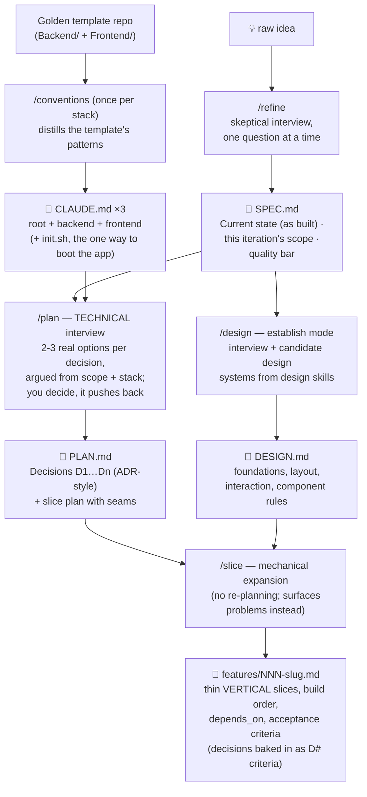
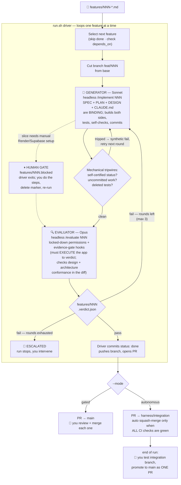
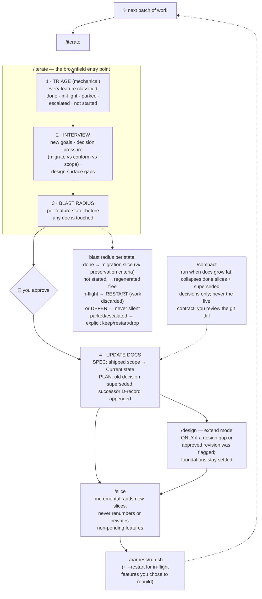
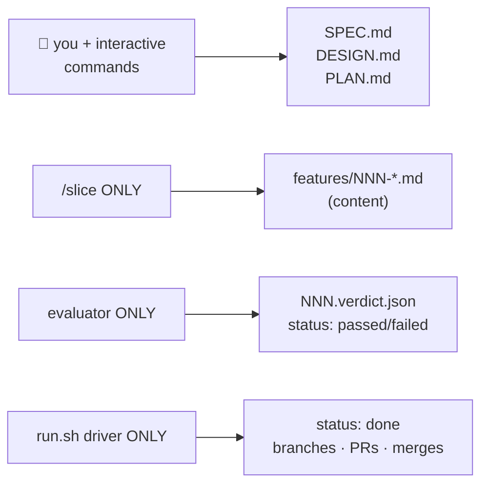
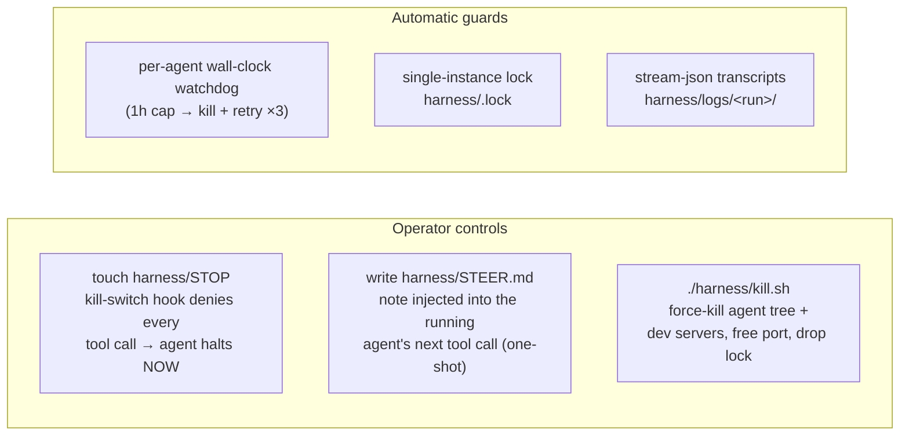

# What the harness does — full pipeline

Three phases. A **first-build phase** where you and Claude produce the contract
documents, the **autonomous phase** where `run.sh` drives a build → judge →
merge loop against those documents, and an **iteration phase** for every batch
after the first, where the docs evolve instead of fossilizing.

## Phase 1 — first build: produce the contracts

The split matters: `/plan` is where you argue architecture (long polling vs
SignalR, soft vs hard deletes) *before* any code exists, because a fresh-context
generator building one thin slice would otherwise make those cross-slice
commitments implicitly. `/slice` then expands an approved plan — decisions
already made, so the expansion is a transformation, not a judgment call.

## Phase 2 — autonomous: run.sh drives the loop

## Phase 3 — iteration: the docs evolve with the app

## The eight commands at a glance

| Command | Who runs it | Reads | Writes | Purpose |
|---|---|---|---|---|
| `/conventions [stack]` | you, once per stack | template codebase | `CLAUDE.md` ×3, `init.sh` | Distill golden-template patterns so every fresh-context agent inherits them |
| `/refine <idea>` | you, first build only | your answers | `SPEC.md` | Skeptical interview → product spec. Stops if SPEC.md exists (use `/iterate`) |
| `/design` | you | `SPEC.md`, design skills | `DESIGN.md` | **Establish**: define the visual language. **Extend**: append rules for new surfaces only; foundations are settled |
| `/plan` | you | `SPEC`, `DESIGN`, `CLAUDE.md` | `PLAN.md` | Technical interview → ADR-style decisions. Defers to `/iterate` once features have shipped |
| `/slice` | you | `PLAN`, `SPEC`, `DESIGN` | `features/NNN-*.md` | Faithful expansion of the approved plan; decisions become D# criteria |
| `/iterate [goal]` | you, existing app | all docs + git + `features/` | `SPEC.md`, `PLAN.md` | Triage → interview → blast radius → doc updates → hand off to `/design`+`/slice` |
| `/compact` | you, occasionally | `SPEC`, `PLAN`, `features/` | `SPEC.md`, `PLAN.md` | Collapse shipped history; never the live contract. Left uncommitted for your review |
| `/implement NNN` | **run.sh** (Sonnet) | feature file, all docs, prior verdict | code, tests, commits | Build one slice end to end; never push/PR |
| `/evaluate NNN` | **run.sh** (Opus) | feature file, all docs, diff, running app | `NNN.verdict.json` | Execute every criterion against the running app; judge, never fix |

## The two agents, deliberately unequal

| | Generator | Evaluator |
|---|---|---|
| Model | Sonnet (cheap, separate quota) | Opus (judgment is the expensive part) |
| Permissions | `acceptEdits` + bash allowlist | Write **only** under `features/`; git mutations denied |
| Job | Build the slice, test it, commit | Run the app, execute every criterion, write verdict — **never fix** |
| Trust | Assumed to cut corners → driver tripwires | Assumed to rubber-stamp → evidence-gate hooks |

## Who owns what (the single-writer rule)

Every artifact has exactly one writer. That's what makes the tripwires
meaningful: a generator setting `status: done`, or a verdict appearing without
execution evidence, is a boundary violation the driver or a hook can catch
mechanically.

## Cross-cutting controls (any time during a run)

**Key idea throughout:** every safeguard is *mechanical* (permissions, hooks,
diff checks, CI, single-writer ownership), not a prompt asking the model to
behave. State lives in git — feature frontmatter, committed `done` flips — so
an interrupted run resumes by re-running `run.sh`, and `/iterate` can
reconstruct the whole picture months later.
